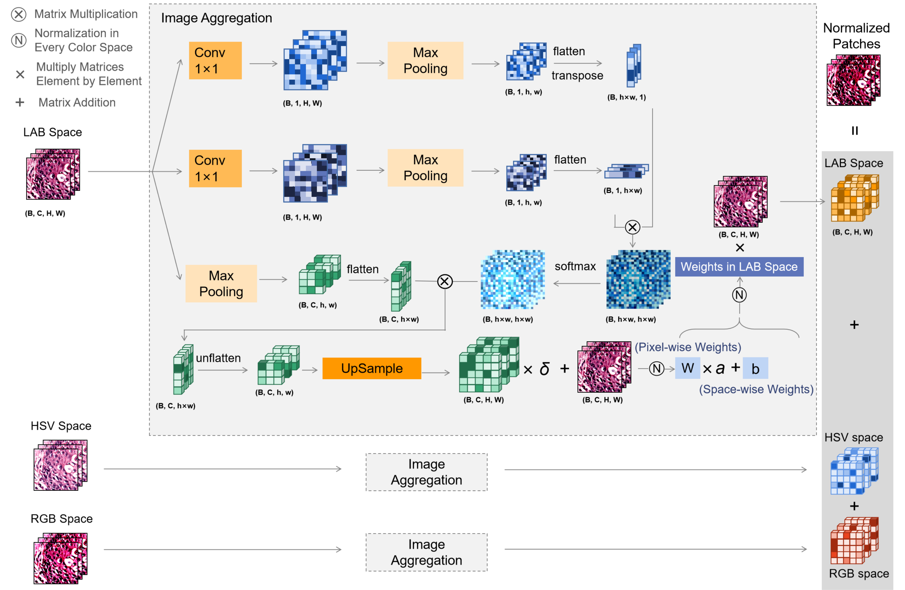

# Optimal-Normalisation-in-Color-Spaces

The implementation of our paper *Learnable Color Space Conversion and Fusion for Stain Normalization in Pathology Image*.
Support training classification networks with the proposed `LStainNorm` inserted at the top of histology datasets. 
In the same way, LStainNorm can be applied to other downstream diagnostic tasks.

------

## Introduction
Variations in hue and contrast are common in H\&E-stained pathology images due to differences in slide preparation across various institutions.
Such stain variations, while not affecting pathologists much in diagnosing the biopsy}, pose significant challenges for computer-assisted diagnostic systems, leading to potential underdiagnosis or misdiagnosis, especially when stain differentiation introduces substantial heterogeneity across datasets from different sources. Traditional stain normalization methods, aimed at mitigating these issues, often require labor-intensive selection of appropriate templates, limiting their practicality and automation. Innovatively, we propose a Learnable Stain Normalization layer, i.e. $LStainNorm$, designed as an easily integrable component for pathology image analysis. It minimizes the need for manual template selection by autonomously learning the optimal stain characteristics. Moreover, the learned optimal stain template provides the interpretability to enhance the understanding of the normalization process. Additionally, we demonstrate that fusing pathology images normalized in multiple color spaces can improve performance. Therefore, we extend $LStainNorm$ with a novel self-attention mechanism to facilitate the fusion of features across different attributes and color spaces. Experimentally, $LStainNorm$ outperforms the state-of-the-art methods including conventional ones and GANs on two classification datasets and three nuclei segmentation datasets by an average increase of 4.78\% in accuracy, 3.53\% in Dice coefficient, and 6.59\% in IoU. Additionally, by enabling an end-to-end training and inference process, $LStainNorm$ eliminates the need for intermediate steps between normalization and analysis, resulting in more efficient use of hardware resources and significantly faster inference time, i.e. up to hundreds of times quicker than traditional methods.

:fire: For more information have a look at our paper [*Learnable Color Space Conversion and Fusion for Stain Normalization in Pathology Image*]([https://markdown.com.cn](https://www.sciencedirect.com/science/article/pii/S1361841524003499)).

Authors: Jing Ke, Yijin Zhou, Yiqing Shen, Yi Guo, Ning Liu, Xiaodan Han, Dinggang Shen 

## News :new:
2024.12.03: Our article was accepted by Medical Image Analysis, the top journal in the field of medical image processing!

## Code Organizations

Run [`main.py`](main.py) to train the models.

Tune all the hyper-parameters in [`config-SA1.yaml`](config-SA1.yaml).
- `train_root`: Path to the training set.
- `test_root`: Path to the test set.
- `output_path`: Path to the output. Output files will be exported to a folder created in `output_path` starting with the date, hence no worry for overriding.

## Dataset

Datasets can be downloaded by links shared in our paper "Learnable Color Space Conversion and Fusion for Stain Normalization in Pathology Image".

## Methods
1. `LabPreNorm`: Learnable normalization parameters (i.e., channel mean and channel std) of the template in LAB color space.
2. `TemplateNorm`: Fixed normalization parameters in LAB space.
3. `SA3`: Our proposed LStainNorm, including color space conversion and fusion.

## Citing Our Work
Please cite the following paper if you use our code:

`@article{ke2025learnable,`
`title={Learnable color space conversion and fusion for stain normalization in pathology images},`  
`author={Ke, Jing and Zhou, Yijin and Shen, Yiqing and Guo, Yi and Liu, Ning and Han, Xiaodan and Shen, Dinggang},`  
`journal={Medical Image Analysis},`  
`volume={101},`
`pages={103424},`  
`year={2025},`  
`publisher={Elsevier}`  
`}`

